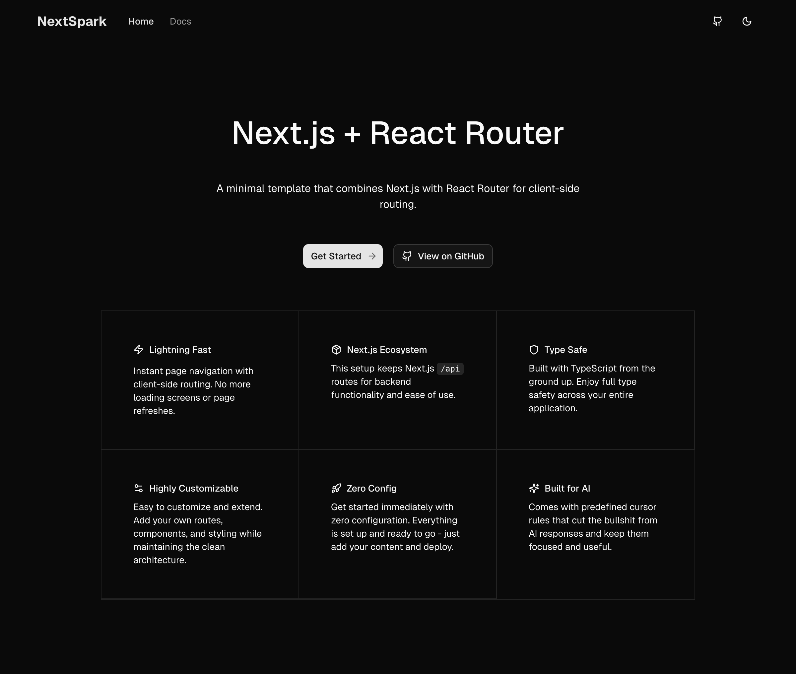

# NextSpark

A minimal template showcasing React Router integration within Next.js for client-side routing



## 🚀 Quick Start

```bash
git clone https://github.com/chargersh/nextspark
cd nextspark
bun install
bun dev
```

Open [http://localhost:3000](http://localhost:3000) to see the app.

## 🏗️ Architecture

NextSpark combines Next.js with React Router for pure client-side routing:

1. **Route Redirection**: All routes redirect to `/shell` via `next.config.ts`
2. **Shell Loading**: Shell page loads React Router app with `ssr: false`
3. **Client Routing**: React Router handles all navigation client-side

## 📁 Key Files

- `next.config.ts` - Route redirection configuration
- `src/app/shell/page.tsx` - Loads React Router app
- `src/frontend/app.tsx` - Main React Router application
- `src/config/site.config.ts` - Site configuration
- `src/routes/` - Route components and layouts

## 🔧 Adding Routes

Add new routes in `src/frontend/app.tsx`:

```tsx
<Route path="/your-page" element={<YourPage />} />
```

## 🎨 Features

- ⚡ Lightning fast client-side routing
- 🎯 Zero-config React Router integration
- 🎨 Modern UI with Tailwind CSS
- 🌙 Dark mode support
- 📱 Responsive design
- 🔧 TypeScript support

## 🛠️ Tech Stack

- **Framework**: Next.js 15
- **Routing**: React Router 7
- **Styling**: Tailwind CSS
- **UI Components**: shadcn/ui
- **Icons**: Lucide React
- **Language**: TypeScript

## 📖 Usage Examples

### Multi-page App

```tsx
<Route path="/products" element={<ProductList />} />
<Route path="/products/:id" element={<ProductDetail />} />
<Route path="/cart" element={<ShoppingCart />} />
```

### Protected Routes

```tsx
<Route
  path="/dashboard"
  element={
    <ProtectedRoute>
      <Dashboard />
    </ProtectedRoute>
  }
/>
```

### Nested Layouts

```tsx
<Route path="/admin" element={<AdminLayout />}>
  <Route path="users" element={<UserManagement />} />
  <Route path="settings" element={<Settings />} />
</Route>
```

## 🤝 Contributing

Contributions are welcome! Please feel free to submit a Pull Request.

## 📄 License

BSD Zero Clause License - see [LICENSE](LICENSE) for details.

## 👤 Author

Created by [chargersh](https://github.com/chargersh) • [GitHub](https://github.com/chargersh/nextspark) • [Twitter](https://x.com/chargersh)
